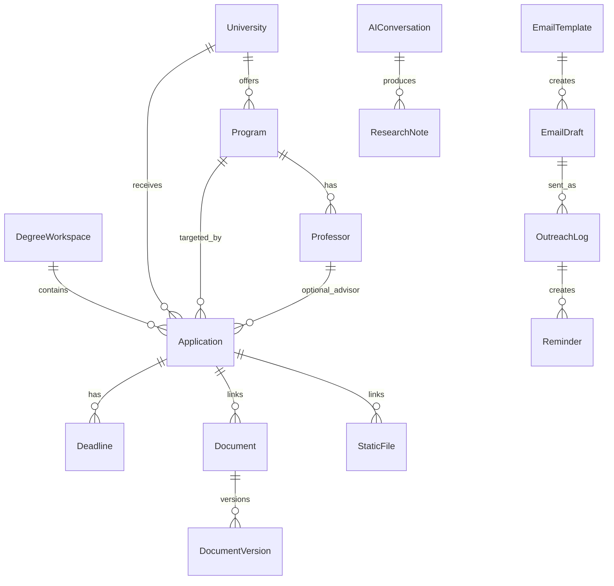

# Domain Relationships

This file describes core entities and how features connect.

## Core Entities

- DegreeWorkspace
- Country
- Region
- University
- Program
- Professor
- Application
- Deadline
- Document
- DocumentVersion
- StaticFile
- EmailTemplate
- EmailDraft
- OutreachLog
- Reminder
- AIConversation
- ResearchNote
- ScholarshipOpportunity

## Relationship Summary

- A DegreeWorkspace has many Countries.
- A Country has many Regions and Universities.
- A Region has many Universities.
- A University has many Programs.
- A Program may have many Professors.
- An Application belongs to a DegreeWorkspace and usually points to a University and Program.
- An Application may optionally point to a Professor.
- An Application has many Deadlines.
- An Application can link many Documents and StaticFiles.
- A Document has many DocumentVersions.
- An EmailDraft can use one EmailTemplate.
- An EmailDraft can link Documents and StaticFiles as attachments.
- An OutreachLog can create a Reminder.
- AIConversation can produce ResearchNotes linked to professors, universities, programs, or applications.
- A ScholarshipOpportunity is user-scoped and independent of DegreeWorkspace/
  Application. "Add to tracker" creates or reuses a project's Scholarship
  Tracker sheet row from an opportunity's extracted fields; the link
  (`linked_sheet_id`) is informational and one-way — the sheet row, not the
  opportunity, is the source of truth once created.
- A HuntProfile (Phase 3) is one JSON blob per user, stored on LocalProfiles
  (`hunt_profile_json`), not a separate entity/table. It is read locally to
  compute a fit score against ScholarshipOpportunity fields; it is never
  sent to any provider.
- A saved Scholarship Hunt query (Phase 4 watchlist) tracks
  `seen_article_ids_json` so re-running it can diff against previously seen
  results — it does not create or reference a ScholarshipOpportunity until
  the user explicitly analyzes/saves a result.

## Central Product Object

Application is the central object for user progress.

It should connect:

- Status
- Deadlines
- Documents
- Static files
- Emails
- Outreach
- Reminders
- AI notes

## Relationship Diagram

