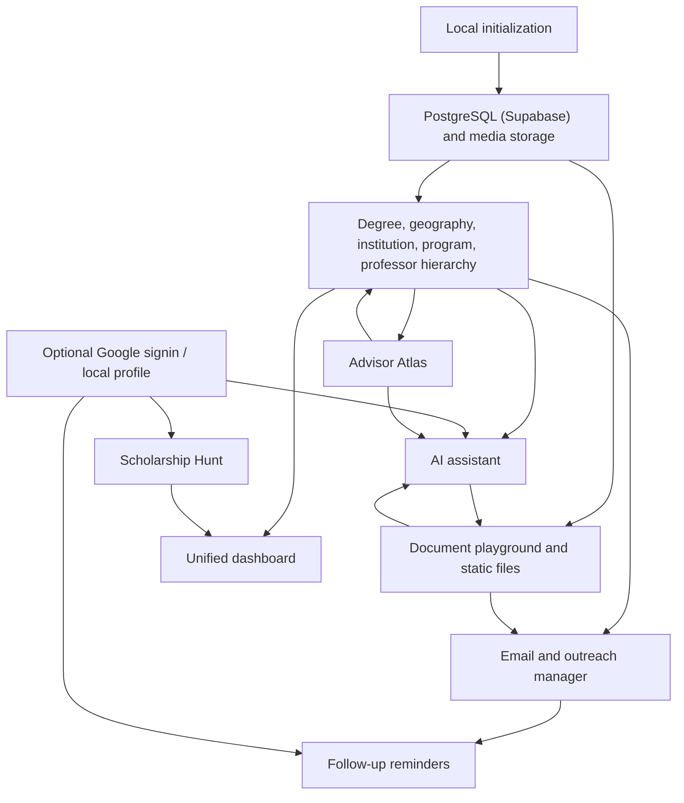

# Feature Map

## Feature Areas

1. Local initialization
2. Degree and application hierarchy
3. Unified dashboard
4. Timeline and reminders
5. Document playground
6. Static file storage
7. Email and outreach manager
8. AI assistant
9. Optional authentication and identity
10. Scholarship Hunt and academic funding discovery
11. Advisor Atlas supervisor intelligence

## Dependency Flow

## Cross-Feature Rules

- Applications are the central unit that connect deadlines, documents, files, emails, AI notes, and statuses.
- Professor records are optional for Bachelor's and coursework Master's flows, but important for PhD and research Master's flows.
- Documents can be general, degree-specific, institution-specific, program-specific, or professor-specific.
- The global dashboard must aggregate across all enabled degree workspaces.
- AI should assist with existing context but not become the system of record.
- Authentication is optional for MVP and must not block local-only workflows unless a later decision changes this.
- Scholarship Hunt must prioritize explicit scholarship/funding relevance over
  broad web matches and remain isolated from AI-chat web research.
- Advisor Atlas must separate research fit, evidence confidence, and recruitment
  state while preserving claim-level public sources.
